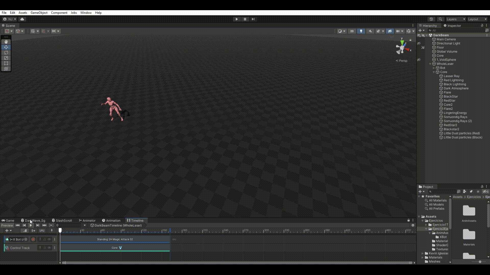

# grimmeon-cg
Grimmeon studio's repo specifically made for computación gráfica.

# First group project: Dark beam

## Video

https://youtu.be/YYbyRFTxQ2c?si=nd1zYFKbkDVVH1IX

## Comparison between value ranges (effect and reference):

## Effect's value range:

# First excercise: Tornado
## Jerónimo Cano:

(YouTube link because the gif looks weird)
https://youtu.be/2Mke7DH_oMc

## Juan Fernando Melo Areiza:

(Also a Youtube Link, the gif looks awful)
https://youtu.be/8ja6CArPE8o

## Juan Pablo Correa Cataño:

Check this one instead pls
https://youtu.be/cNnWaj64hLw
