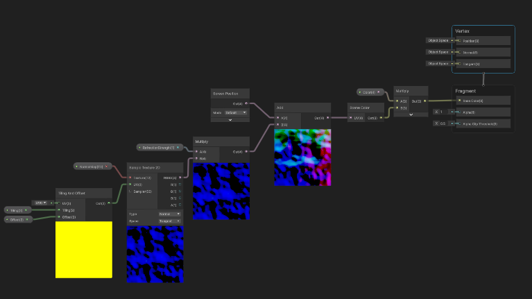
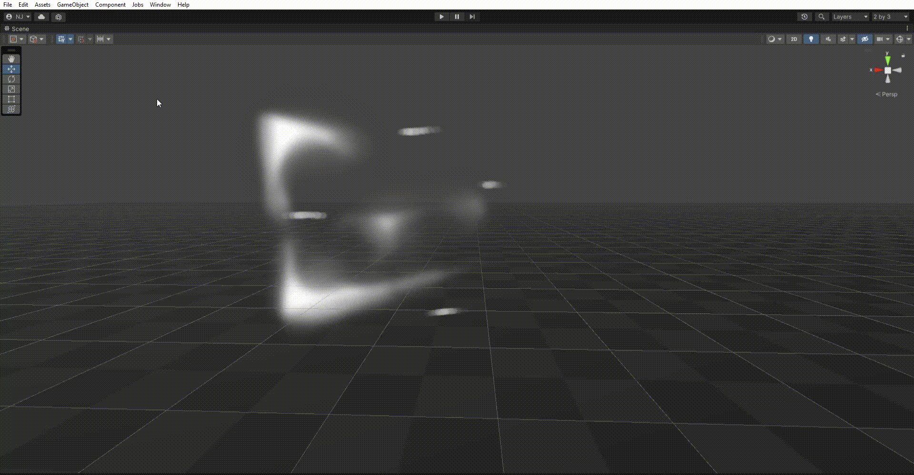
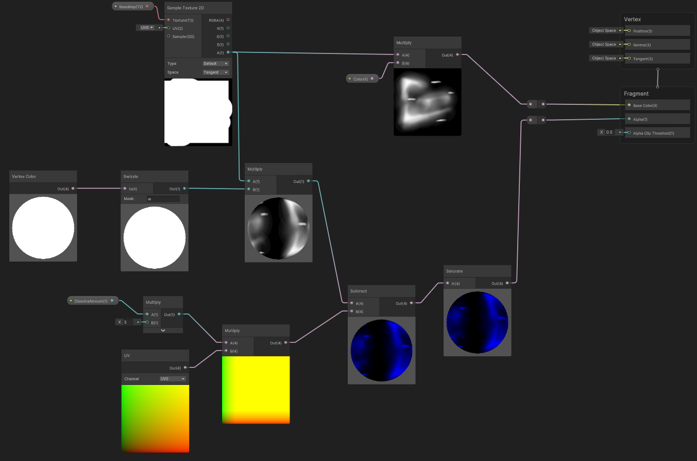
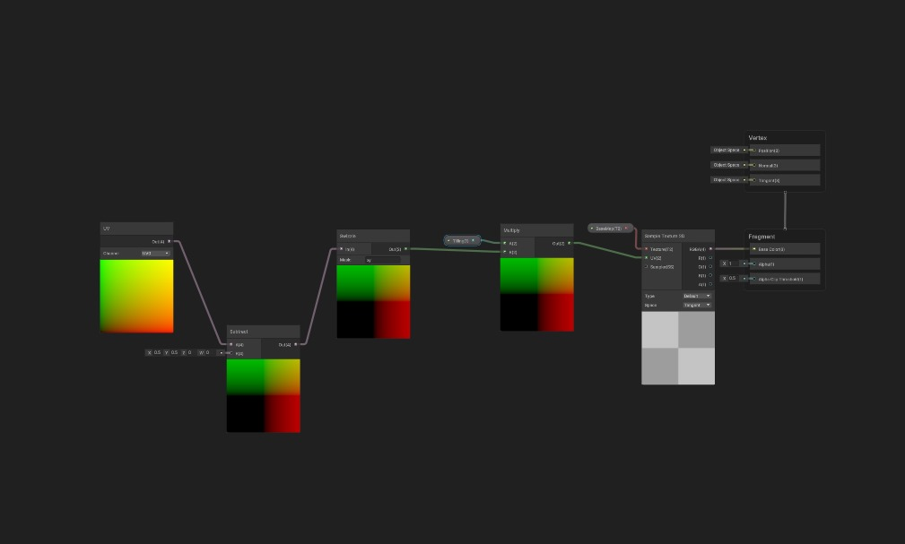
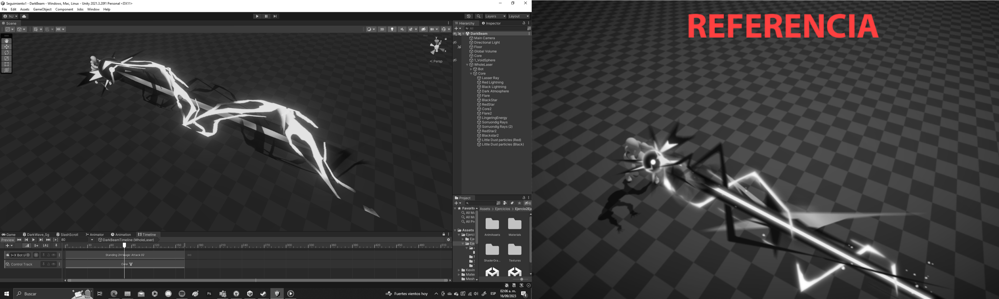
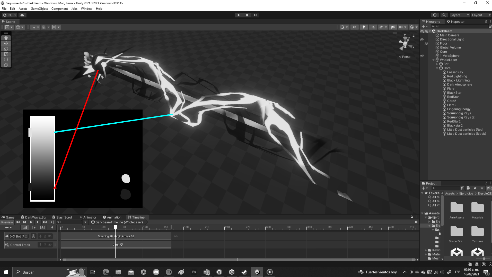
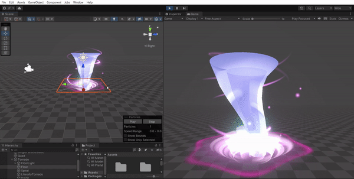
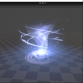

# Grimmeon: Computación Gráfica
Grimmeon studio's repo specifically made for computación gráfica.
# Second group project: Shaders
## First Section: Masks - Juan Pablo Correa
### Multi-Channel Mask
Material changing the 3 RBG chanels based on masks

Shader Graph:

### Radial Procedural Mask
Masking Material with a sphere Mask Node

Shader Graph: 

## Second Section: Distortion - Juan Fernando Melo
### Refraction

Shader Graph:

## Third Section: Erosion - Jerónimo Cano Álvarez
### Dissolve pre-made texture

### Noise Dissolve

## Fourth Section: Polar Coordinates - Team Work
### Procedural Polar Coordinates
Tiling Textures based on Polar coordinates (Additional Center option)

Shader Graph:

### Mirrored Texture
Tiling Texture based on a mirrored texture

Shader Graph:

# First group project: Dark beam

## Video

https://youtu.be/YYbyRFTxQ2c?si=nd1zYFKbkDVVH1IX

## Comparison between value ranges (effect and reference):

## Effect's value range:

# First excercise: Tornado
## Jerónimo Cano:

(YouTube link because the gif looks weird)
https://youtu.be/2Mke7DH_oMc

## Juan Fernando Melo Areiza:

(Also a Youtube Link, the gif looks awful)
https://youtu.be/8ja6CArPE8o

## Juan Pablo Correa Cataño:

Check this one instead pls
https://youtu.be/cNnWaj64hLw
